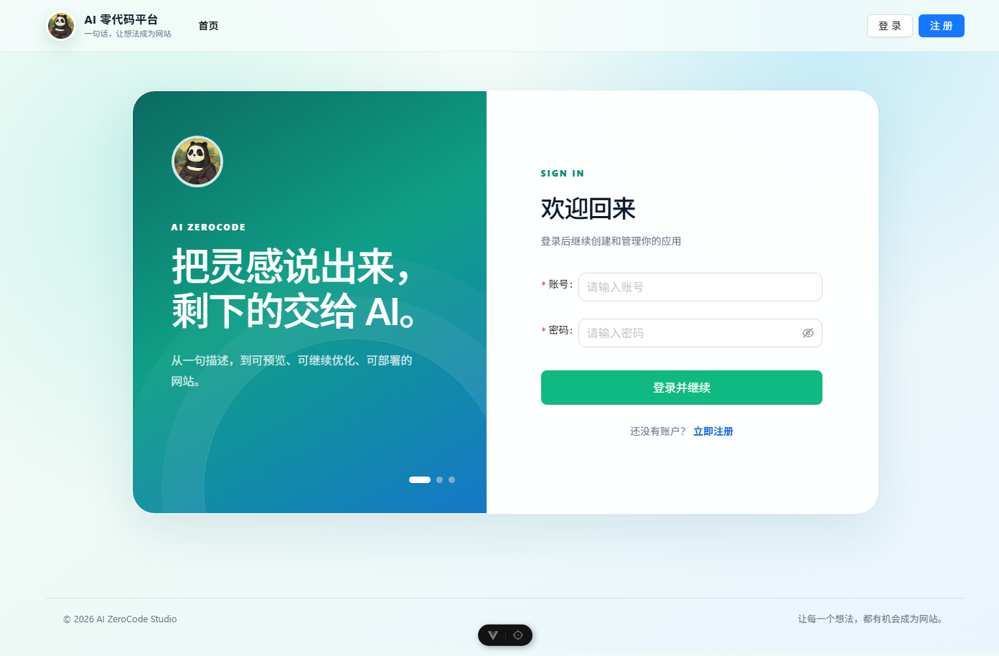
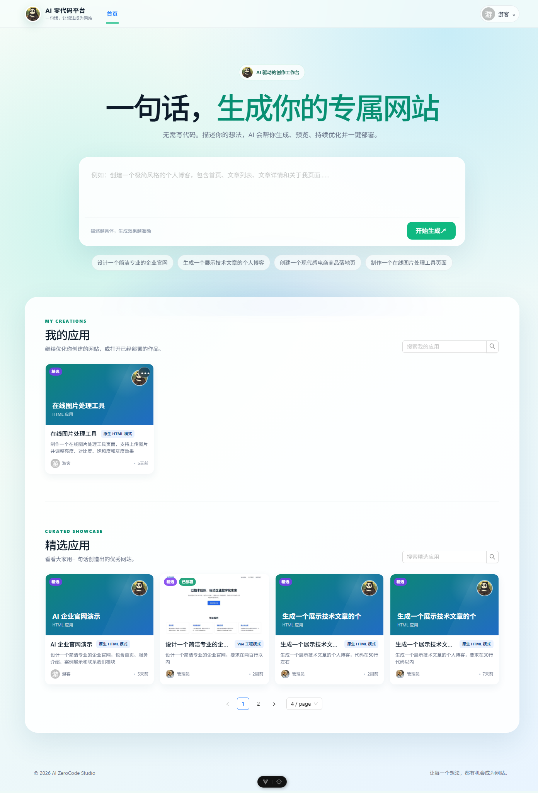
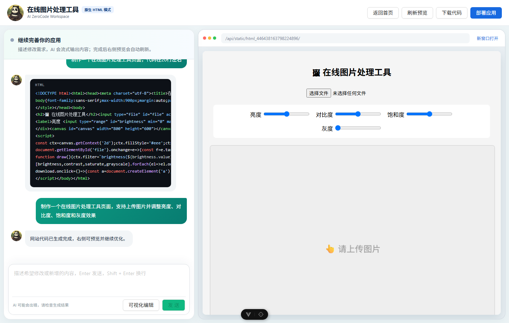

# AI ZeroCode 零代码应用生成平台

AI ZeroCode 是一个基于 AI 的零代码网站生成平台。用户只需要用自然语言描述想法，系统就可以创建应用、进入对话式生成工作台，持续生成和优化网站代码，并支持在线预览、代码下载、应用部署和应用管理。

## 在线演示

- 演示站：[http://203.195.203.14:8080/](http://203.195.203.14:8080/)
- 健康检查：[http://203.195.203.14:8080/api/actuator/health](http://203.195.203.14:8080/api/actuator/health)

演示环境运行在单台 4 核、约 4 GB 内存的轻量应用服务器上，采用 OpenResty + systemd + MySQL + Redis 的单机部署结构。为避免 AI 生成、Node.js 构建和 Chromium 截图同时耗尽内存，线上固定全局生成并发为 1，每个账号每天最多发起 10 次生成。

生成源码、预览和临时部署产物保存在服务器本地，最多保留 24 小时。产物过期后，应用和对话历史仍然保留，但页面会明确提示重新生成，并禁用失效的预览、下载和部署操作。Vue 构建完成后会删除项目内的 `node_modules`，npm 公共缓存单独保留以加速后续构建。

> 2026-09-01 的量化验证后，线上模型供应商返回 `402 Payment Required: Insufficient Balance`。在补充模型余额前，登录、应用列表、历史记录、已有预览和部署页面仍可使用，但新建应用的 AI 路由与代码生成可能失败。

## 线上实测结果

测试时间：2026-09-01。以下数字均来自公网 OpenResty 链路，不是本地估算值。

- 三种模式均完成过公网完整流程：HTML、Multi-File、Vue Project。
- 30 条固定 Prompt 已全部登记；余额耗尽前实际执行 24 条，其中 22 条完成生成、下载、预览和部署，2 条真实失败，另外 6 条在应用路由前被供应商余额阻断。
- 已执行 Prompt 成功率：91.67%（22/24）；按原定 30 条计划计算为 73.33%（22/30）。
- 分模式结果：HTML 10/10；Multi-File 9/10；Vue 3/4 已执行成功，另有 6 条未执行。
- 22 条成功流的 SSE 流式返回率为 100%；首段 P95 为 164.52 秒，完整生成 P95 为 207.49 秒，平均完整生成耗时为 122.60 秒。
- 成功样本的源码完整率、ZIP 路径安全率、下载成功率、预览成功率和部署成功率均为 100%。
- 成功 Vue 样本构建率为 100%（3/3），构建后的 `node_modules` 清理率为 100%（3/3）。
- 认证普通接口 `GET /api/user/get/login`：100 请求、10 并发、100% 成功，吞吐 122.75 请求/秒，平均 77.43 ms，P50 59.00 ms，P95 178.66 ms，P99 236.52 ms。
- 离线核心回归：23 个测试通过、1 个 Unix 专属 symlink 用例在 Windows 跳过；覆盖 200 组解析、绝对路径和 `../` 拒绝、跨应用访问、生成租约、全局并发 1、每日配额、Vue 构建和 `node_modules` 清理。
- 模型 Token 用量当前无法统计，因为生产接口和供应商响应没有向业务侧暴露 usage 数据；README 不进行估算。

生产验证还覆盖了第 11 次生成配额拒绝、全局并发槽拒绝、过期产物清理、数据库备份恢复、Redis Session 重启持久化、两个 Java 服务和 OpenResty/MySQL/Redis 逐项重启，以及 systemd 异常退出自动拉起。

## 项目展示

### 登录页



### 应用首页



### AI 生成工作台



## 核心功能

- 自然语言创建应用：输入一句网站需求，创建专属应用项目。
- AI 代码生成：支持原生 HTML、多文件项目、Vue 工程等生成模式。
- 流式对话工作台：AI 生成内容实时输出，右侧同步预览生成效果。
- 可视化编辑：在预览区域选择页面元素，并通过对话继续修改。
- 应用管理：支持我的应用、精选应用、应用详情、应用编辑和删除。
- 代码下载与部署：生成后可下载项目源码，也可以部署为可访问页面。
- 用户体系：支持注册、登录、登录态持久化和管理员权限校验。
- 对话历史：基于应用维度保存用户与 AI 的生成记录。
- 可观测能力：集成 Spring Boot Actuator、Prometheus 指标采集能力。

## 技术栈

### 后端

- Java 21
- Spring Boot 3.5.x
- MyBatis-Flex
- MySQL
- Redis / Redisson / Spring Session
- LangChain4j
- LangGraph4j
- Reactor SSE
- Selenium / WebDriverManager
- 腾讯云 COS
- Knife4j / SpringDoc OpenAPI
- Spring Boot Actuator / Micrometer / Prometheus

### 前端

- Vue 3
- TypeScript
- Vite
- Vue Router
- Pinia
- Ant Design Vue
- Axios
- Markdown-it
- Highlight.js

## 项目结构

```text
ai-zero-code
├── ai-zero-code-fontend/ai-zero-code-fontend  # 前端项目
├── sql                                        # 数据库初始化脚本
├── src/main/java/com/cyx/aizerocode           # 后端业务代码
├── src/main/resources                         # 后端配置、Mapper、Prompt
├── docs/images                                # README 展示截图
├── pom.xml                                    # Maven 配置
└── README.md
```

## 环境要求

- JDK 21+
- Maven 3.9+，也可以直接使用项目内置的 `mvnw`
- Node.js 22.18+ 或 24.12+
- MySQL 8.x
- Redis 5.x+

## 后端启动

1. 初始化数据库：

```bash
mysql -u root -p < sql/create_table.sql
```

2. 准备本地配置文件：

项目默认会启用 `local` profile。请在 `src/main/resources/` 下创建本地配置文件：

```text
src/main/resources/application-local.yml
```

本地配置文件不要提交到 Git。可以按下面结构填写自己的本地数据库、Redis、AI 模型和对象存储配置：

```yaml
spring:
  datasource:
    url: jdbc:mysql://localhost:3306/zero_code?useUnicode=true&characterEncoding=UTF-8&serverTimezone=Asia/Shanghai&useSSL=false&allowPublicKeyRetrieval=true
    username: root
    password: your_mysql_password
  data:
    redis:
      host: localhost
      port: 6379
      password:
      database: 0
  session:
    redis:
      namespace: zerocode:session

langchain4j:
  open-ai:
    chat-model:
      base-url: https://api.deepseek.com
      api-key: your_api_key
      model-name: deepseek-v4-flash
    streaming-chat-model:
      base-url: https://api.deepseek.com
      api-key: your_api_key
      model-name: deepseek-v4-flash
    reasoning-streaming-chat-model:
      base-url: https://api.deepseek.com
      api-key: your_api_key
      model-name: deepseek-v4-pro
    routing-chat-model:
      base-url: https://api.deepseek.com
      api-key: your_api_key
      model-name: deepseek-v4-flash

cos:
  client:
    host: your_cos_domain
    secretId: your_secret_id
    secretKey: your_secret_key
    region: ap-shanghai
    bucket: your_bucket

pexels:
  api-key: your_pexels_api_key

dashscope:
  api-key: your_dashscope_api_key
  image-model: wan2.2-t2i-flash

zerocode:
  code:
    output-root: /opt/resume-demo/zero-code/tmp/code_output
    deploy-root: /opt/resume-demo/zero-code/tmp/code_deploy
    public-base-url: http://PUBLIC_IP:8080
  screenshot:
    temp-root: /opt/resume-demo/zero-code/tmp/screenshots
    chrome-binary-path: /usr/bin/google-chrome
    chrome-driver-path: /usr/local/bin/chromedriver
  build:
    npm-executable: /usr/bin/npm
    npm-cache-root: /opt/resume-demo/zero-code/npm-cache
  generation:
    global-concurrency: 1
```

3. 启动 Redis。

4. 启动后端：

```bash
./mvnw spring-boot:run
```

Windows 环境可以使用：

```bash
mvnw.cmd spring-boot:run
```

后端默认访问地址：

```text
http://localhost:8123/api
```

健康检查：

```text
http://localhost:8123/api/actuator/health
```

接口文档：

```text
http://localhost:8123/api/doc.html
```

## 前端启动

进入前端目录：

```bash
cd ai-zero-code-fontend/ai-zero-code-fontend
```

安装依赖：

```bash
npm install
```

准备前端环境变量：

```bash
cp .env.example .env
```

默认配置：

```env
VITE_API_BASE_URL=/api
VITE_DEPLOY_DOMAIN=http://localhost
```

公网 IP 阶段部署 ZeroCode 前端时可设置：

```env
VITE_API_BASE_URL=/api
VITE_DEPLOY_DOMAIN=http://PUBLIC_IP:8080/deploy
```

启动前端：

```bash
npm run dev
```

前端默认访问地址：

```text
http://localhost:5173
```

## 打包构建

后端构建：

```bash
./mvnw clean package
```

前端构建：

```bash
cd ai-zero-code-fontend/ai-zero-code-fontend
npm run build
```

## 安全说明

本项目已配置 `.gitignore`，默认忽略以下敏感或临时内容：

- `application-local.yml`
- `.env`、`.env.*`
- `tmp/`
- `target/`
- `node_modules/`
- `dist/`
- 日志文件和本地 IDE 配置

Maven 构建还会显式排除 `application-local.yml` 和 `application-*.local.yml`。即使本地配置文件存在于 `src/main/resources`，也不会进入生产 Fat JAR，避免数据库密码、Redis 密码、AI Key 和对象存储凭据随构建产物发布。

请不要把真实的数据库密码、AI API Key、对象存储密钥、云服务 Token 提交到 GitHub。公开仓库中只保留占位配置或示例配置，真实配置请放在本地忽略文件、环境变量或部署平台的 Secret 配置中。

## 备注

README 中的截图来自本地运行效果，仅用于展示页面功能。不同本地数据、AI 生成结果和部署配置下，页面内容可能会有所不同。
